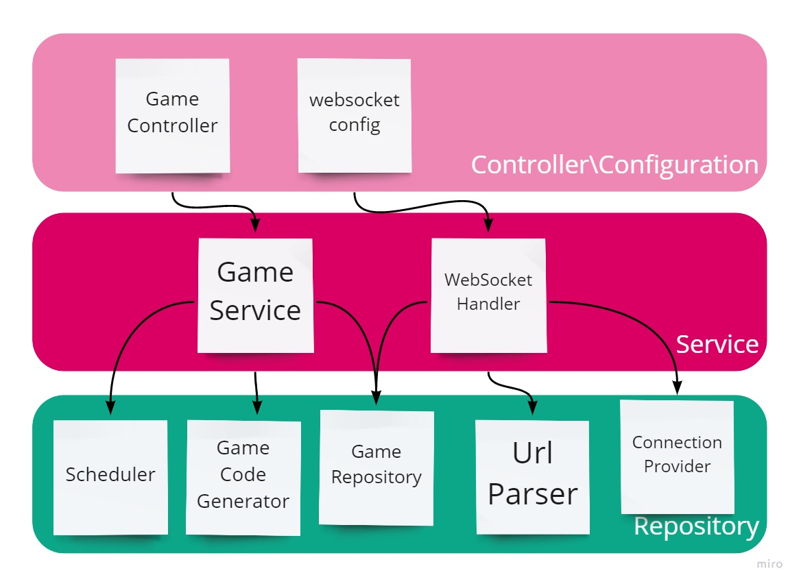
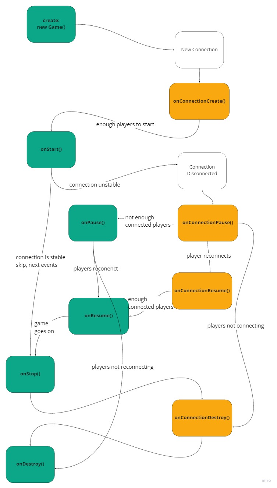

# Partydeck live server

Made with Java 11 and Spring Boot.

## Architecture



My application consists of 5 repositories, 2 services and 1 controller as well as the websocket configuration. It uses the `models` folder to create an in-memory cache of games and players.

### Models

The models folder is a pure java folder that consists of 4 main models, as well as helpers.

```java
public abstract class Player implements Identifiable<String>
```

The player model is responsible for the java logic of a player entity. It's capabilities:

- Maintaining the deck of cards the player has, adding to it and removing from it.
- Maintaining admin and judge personal states
- Attaching admin, judge and deck personal states to broadcasts
- Handling messages from client

Its abstract methods (anything Websocket related):

- broadcasting to client utils
- disconnection utils

```java
public class Game implements PlayerEventListener, RoundEventListener, Identifiable<String>
```

The game model is reponsible for handling all of the Player, and round events:

- connection create, resume, pause, destroy
- player card usage and judge pick
- admin player skips, start/next round requests and stops
- round start, judge options ready
- unexpecte round ends

Toghether with the connection states, it creates the following game life cycle:



```java
public enum BroadcastContext
```

The broadcast context enum contains all possible contexts for the server to broadcast to the client, or the client fo broadcast to the server. Meaning, all of the events mentioned above that the game handles, in addition to:

- Game Start
- Game Resume
- Game Pause
- Game Stop
- Game Destroy

The player model uses this context to attach the unique fields to the broadcasts

```java
public interface GameEventListener
```

The interface that is responsible for handling game events in the macro level of the server.

### Repositories

```java
@Repository
public class ConnectionProvider
```

The connection provider is responsible for storing all of the active connections in the game, providing the following methods:

- add new connection
- revive paused connection
- handle new message
- handle connection close (distinguish between pause and destroy)
- handle connection destroy if needed

It does it by having a private extension of the abstract `Player` model, that is able to send messages, decode messages from the client, close connections and so on.

It then keeps a map from the session ids to the matching `SessionWrapperPlayer`s.

```java
@Repository
public class GameRepository implements GameEventListener
```

The game repository is responsible for handling game events, and provides the following methods:

- create new game with a given code
- add new player to the game with the specified code
- resume the connection of a player to the game with the specified code
- remove game if not active
- check if a game with the given code is present

it does it by keeping a map from the game code to the matching game.

---

Apart from that, we also have the `Scheduler`, `UrlParser` and `GameCodeGenerator` components. Those are small repositories that provide very specific methods.

### Services

```java
@Service
public class GameService
```

The game service combines the power of the scheduler, game code generator and the game repository to create an outstanding interface with two methods:

- create game with a given list of questions and list of answers
- check if a game with a given code exists

Those methods are the ones used in the `GameController`.

```java
@Component
public class WebSocketHandler extends TextWebSocketHandler
```

This component combines the power of the connection provider, the scheduler and the url parser in order to implement the following 3 methods from the `TextWebsocketHandler` class:

- on connection create - it distinguishes between connection create and resume
- on message
- on connection close
